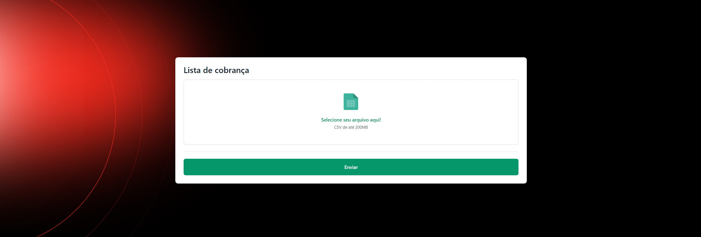
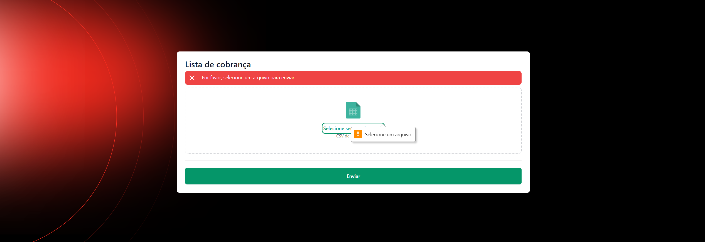
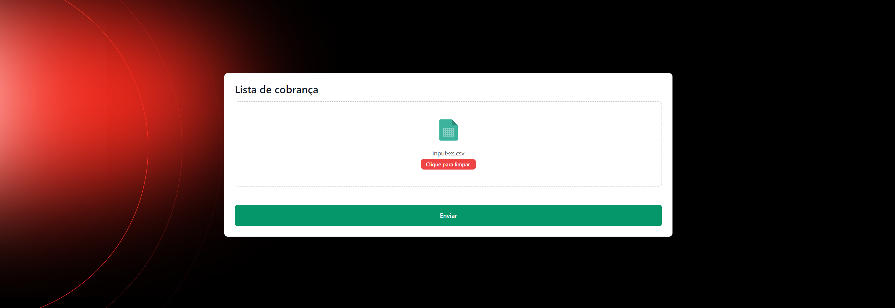
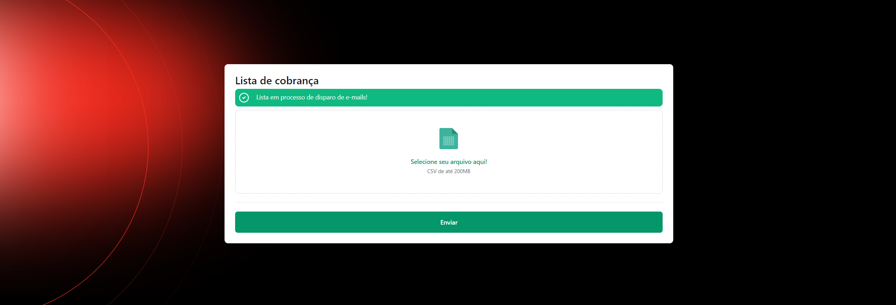

# kanastra-upsend

## Configuração do Ambiente
1. Clone o repositório do projeto
    ```shellScript
    git clone git@github.com:websterl3o/kanastra-upsend.git
    ```
2. Crie o arquivo .env apartir do .env.example
    ```shellScript
    cp .env.example .env
    ```
3. Execute o comando para subir o ambiente
    ```shellScript
    docker-compose up -d --build
    ```
4. Execute o comando para instalar as dependências do projeto
    ```shellScript
    docker-compose exec app composer install
    ```
5. Execute o comando para gerar a chave do projeto
    ```shellScript
    docker-compose exec app php artisan key:generate
    ```
6. Execute o comando para criar a estrutura do banco de dados
    ```shellScript
    docker-compose exec app php artisan migrate
    ```
7. Instalar dependencias do node
    ```shellScript
    docker-compose exec app npm install
    ```
8. Acesse o projeto em http://localhost:9696

## Comandos Úteis
### Executar testes
```shellScript
docker-compose exec app php artisan test
```

### Gerar coverage html
```shellScript
docker-compose exec app php artisan test --coverage-html=coverage-html
```

### Executar os jobs
```shellScript
docker-compose exec app php artisan queue:work
```

## Alguns Screenshots da tela do projeto:

### Tela inicial de upload de lista de cobrança


### Caso não tenha nenhum arquivo anexado e tentar enviar


### Caso o arquivo anexado não seja um arquivo CSV


### Anexando um arquivo CSV


### Após selecionar e enviar o arquivo no formato correto

